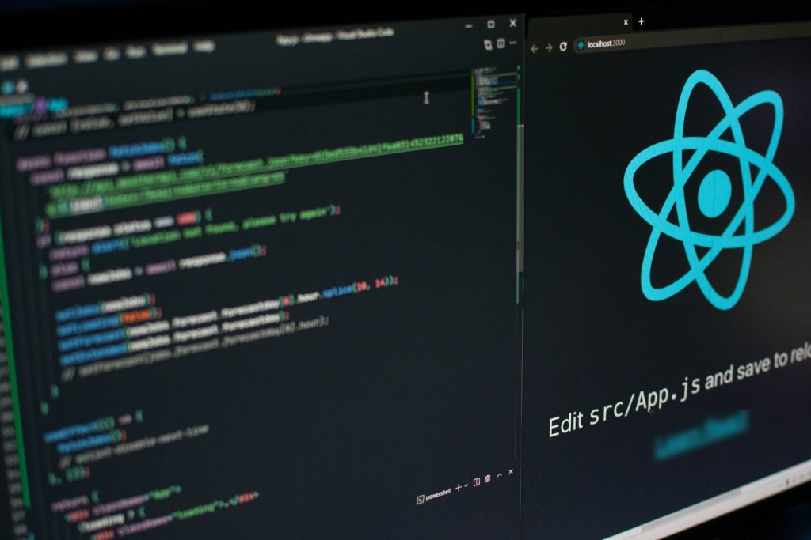

import imageScott from '@/images/team/scott.jpg'

export const article = {
  date: '2024-02-18',
  title: 'Riding the Wave: From WordPress to React and Why We Love PayloadCMS',
  description:
    'Ahoy, web enthusiasts! Discover why more people are migrating from WordPress to React and falling in love with PayloadCMS with us at Coastal Sites.',
  author: {
    name: 'Scott Phelps',
    role: 'Full Stack Developer',
    image: { src: imageScott },
  },
}

export const metadata = {
  title: article.title,
  description: article.description,
}

Hey there, web enthusiasts! 
If you’ve been keeping an eye on the latest web development trends, you’ve probably noticed some exciting changes. 
Here at Coastal Sites, your trusty web, development, design, and hosting crew from the Gulf Coast of Alabama, 
we’re here to chat about the shift from WordPress to React and why PayloadCMS is becoming a favorite among our clients. 
So, let’s dive in and catch some digital waves together!

## The Shift from WordPress to React

For years, WordPress has been the go-to for many folks looking to build a website. It’s user-friendly, has a ton of plugins, and pretty much ruled the web. But lately, more and more developers are jumping ship and heading towards React. Why, you ask? Well, it comes down to a few key things.

First off, React offers a performance boost that’s hard to beat. Its component-based structure makes for faster rendering and a smoother user experience. Think of it like a speedboat cutting through the waves – quick, efficient, and just plain fun. Plus, React’s modular approach makes scaling your project a breeze. Whether you’re building a simple blog or a complex web app, React handles it with ease.

Another big reason for the shift is the overall developer experience. React is incredibly flexible and comes with a vast ecosystem of tools and libraries. It’s like having a well-stocked fishing boat, ready for any adventure. Developers love this flexibility, and it shows in the projects they create.

## The Move from Client-Side to Server-Side

One of the biggest trends we’re seeing is the switch from client-side to server-side rendering. Back in the day, client-side was all the rage, but now server-side is making a strong comeback. This shift has some significant advantages, especially when it comes to SEO and performance.

Server-side rendering (SSR) means your web pages are generated on the server and then sent to the client. This results in faster load times because the heavy lifting is done before the page even hits your browser. For SEO, this is a game-changer. Search engines love fast, responsive sites, and SSR makes sure your site is as appealing to Google as a freshly caught fish is to a hungry pelican.

Not only does SSR improve load times and SEO, but it also enhances the overall user experience. Users get to see your content faster, which keeps them engaged and happy. It’s like having a smooth, steady ride on a calm sea – no bumps, just smooth sailing.

## Why PayloadCMS is Our Favorite Catch

Finding the right CMS to pair with it is crucial. That’s where PayloadCMS comes in. This headless CMS is a dream come true for us and our clients.

PayloadCMS is all about flexibility. Since it’s headless, it decouples the content management from the presentation layer. This means we can use React (or any other front-end technology) without any restrictions. It’s like having a versatile fishing rod that works perfectly in any water.

Our clients love PayloadCMS for its intuitive interface. Updating content is a breeze, and they don’t need to worry about messing with the site’s design or structure. Plus, PayloadCMS is built with performance and security in mind. It’s fast, reliable, and keeps everything running smoothly. It’s like having a well-maintained boat that’s always ready for a day on the water.

The community and support behind PayloadCMS are also top-notch. There’s always someone ready to help out or share a tip, making it feel like a close-knit fishing village where everyone looks out for each other.

## Setting Sail with Coastal Sites

At Coastal Sites, we’ve embraced these trends and are helping our clients transition from WordPress to React with PayloadCMS. The results? Stunning, high-performing websites that look great and work even better.

We believe in crafting digital experiences that not only look good but also perform flawlessly. By leveraging the power of React and the flexibility of PayloadCMS, we’re able to deliver websites that are as beautiful as a Gulf Coast sunset and as reliable as the tides.

Ready to catch the next wave with us? Drop us a line, and let’s set sail on your next web development adventure together!

